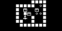
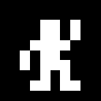

# Arduban

A [Sokoban](http://sokobano.de/wiki/index.php?title=Main_Page) clone
for the [Arduboy](https://arduboy.com/). The game currently has **330 Levels**.
Because there are so many levels, none of the levels are locked.

**Warning** - This game saves your best score for every level. Because of this,
it uses most of the EEPROM memory. This means it will likely overwrite data
stored by any other game. If you switch games often and don't want to lose your
saved progress, **back up your EEPROM**.

**Intro Screen**


**Screenshot**



## Playing

The objective of the game is to move the man, pushing all of the boxes onto the
goal squares. You can only push the boxes, you cannot pull them and you can only
push one box at a time. The game keeps track of the number of moves you've made
and saves your best scores (lowest number of moves) for each level.

## Controls

### Intro Screen

|       |                                         |
|-------|-----------------------------------------|
| A     | Opens the currently selected level      |
| B     | Opens the settings screen               |
| UP    | Selects the previous level              |
| DOWN  | Selects the next level                  |
| LEFT  | Selects the previous **unsolved** level |
| RIGHT | Selects the next **unsolved** level     |

### Game Screen

|       |                                              |
|-------|----------------------------------------------|
| A     | Undo one move. Hold for 5 sec to reset level |
| B     | Returns to the Intro screen                  |
| UP    | Moves the player up                          |
| DOWN  | Moves the player down                        |
| LEFT  | Moves the player left                        |
| RIGHT | Moves the player right                       |

### Level Solved Screen

|       |                             |
|-------|-----------------------------|
| A     | Opens the next level        |
| B     | Returns to the Intro screen |

### Settings Screen

|       |                               |
|-------|-------------------------------|
| A     | Selects the current setting   |
| B     | Returns to the Intro screen   |
| UP    | Moves to the previous setting |
| DOWN  | Moves to the next setting     |

## Images

### Player

Our trusty player, ready and willing to push boxes around for a living!



### Box

These are the objective, push these onto the goals.


### Goal

This is where you want to push the boxes to.


### Box on Goal

This is the objective of the game, move boxes onto the goals in the least moves
possible.


### Wall

You can't move here...


## ParseLevels

This .NET Core program takes levels in a simple TXT format and converts them
to C code to add into the `levels.h` file. The level files are in the `Assets\Levels`
directory.

This program looks at each level and skips levels that are bigger than 16x8 squares.
If a level is taller than it is wide, it rotates the level to fit better on the
Arduboy screen. It then centers the level if it is smaller than 16x8.

Lastly, it compresses the levels using a simple run length encoding (RLE) format
inspired by the the Sokoban XSB format, but modified to take fewer bytes of memory
on the Arduboy. As of this writing, I've managed to load 295 levels and use 89%
of memory. I will probably want to reduce that to around 255 levels to make room
for more bitmaps.

You must have .NET Core 2.1 installed. The utility is run with a command like the following;

```
dotnet run -- 'C:\src\Arduino\Arduboy\Arduban\Assets\Levels\Microban.txt' 'C:\src\Arduino\Arduboy\Arduban\Assets\Levels\Microban II.txt'  'C:\src\Arduino\Arduboy\Arduban\Assets\Levels\Microban III.txt' 'C:\src\Arduino\Arduboy\Arduban\Assets\Levels\Microban IV.txt' 'C:\src\Arduino\Arduboy\Arduban\Assets\Levels\Sasquatch.txt'  'C:\src\Arduino\Arduboy\Arduban\Assets\Levels\Sasquatch II.txt'  'C:\src\Arduino\Arduboy\Arduban\Assets\Levels\Sasquatch III.txt'  'C:\src\Arduino\Arduboy\Arduban\Assets\Levels\Sasquatch IV.txt'  'C:\src\Arduino\Arduboy\Arduban\Assets\Levels\Sasquatch V.txt'  'C:\src\Arduino\Arduboy\Arduban\Assets\Levels\Sasquatch VI.txt'  'C:\src\Arduino\Arduboy\Arduban\Assets\Levels\Sasquatch VII.txt'  'C:\src\Arduino\Arduboy\Arduban\Assets\Levels\Sasquatch VIII.txt'  'C:\src\Arduino\Arduboy\Arduban\Assets\Levels\Sasquatch IX.txt'  'C:\src\Arduino\Arduboy\Arduban\Assets\Levels\Sasquatch X.txt'  'C:\src\Arduino\Arduboy\Arduban\Assets\Levels\Sasquatch XI.txt'  'C:\src\Arduino\Arduboy\Arduban\Assets\Levels\YoshioMurase.txt' > C:\src\Arduino\Arduboy\Arduban\Arduban\levels.h
```

To make this easier, running the batch file `GenerateLevels.cmd` will regenerate
the levels.

## Credits

The game uses levels created by [David W. Skinner](http://www.abelmartin.com/rj/sokobanJS/Skinner/David%20W.%20Skinner%20-%20Sokoban.htm)
and Yoshio Murase. This game makes use of the [4x6 Font by Filmote](https://github.com/filmote/Font4x6) which is under the
BSD-3 license. This game is under the [MIT License](LICENSE).

Thanks to [@Pharap](https://community.arduboy.com/u/Pharap) and
[@Mr.Blinky](https://community.arduboy.com/u/Mr.Blinky) from the
[Arduboy Community](https://community.arduboy.com/) for memory reduction ideas
and help.